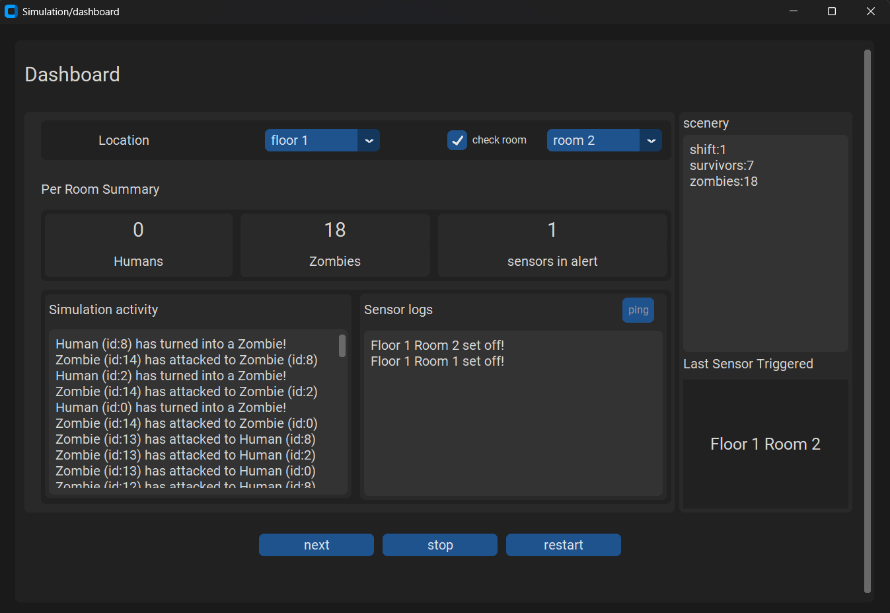

# Simulador de Invasión Zombie (Spanish Version)

Resolución del desafío técnico de **Flair** escrito en `Python`.
Candidato autor: [Osvaldo Herrera](https://datadrivingexpert.github.io/my-portfolio/).

### Descripción breve

En esta simulación, los zombies atacan el edificio. Los humanos lo defienden.  
Los zombies se moverán por el edificio hasta encontrar humanos, cuando los encuentren, no seguirán avanzando hasta acabarlos. El movimiento de los zombies siempre es de _traslado_.  
Por otro lado, los humanos juegan a la defensiva. Pelearán y no se moverán a menos que se vean superados en número de 2 a 1.  
Los zombies siempre aparecerán en el primer piso, primera habitación. Por otro lado, los humanos pueden aparecer en ubicaciones aleatorias del edificio.

### Instalación

Se recomienda encarecidamente crear un entorno virtual para garantizar una correcta instalación.
La versión específica de `Python` utilizada es la `3.12.6`.

1. ejecute:
   > pip install -r requirements.txt
2. arranque el programa desde el punto de entrada `zombie-simulation/main.py`:

- Linux
  > python3 main.py
- O para Windows
  > python main.py

### Ejemplo de uso: Graphic User Interface

#### Configuración de la simulación

En primer lugar, se debe configurar los aspectos generales de la simulación. Esto es sencillo e intuitivo. Tras seleccionar la cantidad, haga clic sobre el botón `start`.

A continuación, la pantalla de Dashboard aparecerá con los detalles de la simulación. Tal y como se muestra en la imagen.

##### Controles

> location

Mediante el `CtkOptionMenu` el usuario puede consultar la información general piso por piso.

> ping

Se puede utilizar una sola vez por turno. El usuario puede realizar un ping hacia todos los sensores del edificio. Permitiendo ver los registros de los sensores en `Sensor logs`.

> next

Permite avanzar la simulación al siguiente turno de juego.

> stop

Detiene la simulación y termina la sesión de simulación.

> restart

Reinicia la sesión de la simulación, con la misma configuración establecida previamente.

### Arquitectura de la solución

El simulador consta de varias clases que definen la estructura del programa.

#### Mapa del juego

##### Arquitectura del mapa

Para que los `NPC` puedan llegar hasta el último piso, tendrán que recorrer el edificio una habitación a la vez. Cuando el personaje no jugador haya llegado a la última habitación del piso, podrá subir al siguiente piso.

Las clases `Building`, `Floor` y `Room` permiten definir objetos que representen esos espacios. Sin embargo, para poder ubicarlos y contener `NPC`s dentro de la simulación, es necesario contar con un mapa que sea capaz de plantear la relación `Location` - `NPC`.
Para lograr este objetivo, se desarrolló un mapa con la estructura y lógica de una matriz de adyacencia. Utilizando la librería `Numpy`.

Cada fila de la matriz de adyacencia representa a una instancia de la clase `NPC`. Cada objeto `NPC` tiene asociado un ID, el cual corresponde al índice de su respectiva fila dentro de la matriz de adyacencia. Así también, se repite el caso para las ubicaciones.

Cada objeto `Location` cuenta con un ID que corresponde con el índice de su respectiva columna dentro del mapa de la simulación.

##### Detalles del mapa

- Limpieza: el simulador se encarga de eliminar a los `NPC` que han muerto. Mediante el método privado `Simulation.__cleaner()`. Quitar `NPC`s del mapa, implica una eliminación de filas en la matriz de adyacencia y una reindexación de los demás.

### Infraestructura de la simulación

- `Simulation`: orquesta los aspectos de la simulación y provee toda la información de lo que está ocurriendo dentro de la simulación.

- `Building`: representa al edificio dentro de la simulación. Considere al edificio como un conjunto de pisos.

- `Floor`: abstracción de los pisos existentes en cada edificio. Considere un piso como un conjunto de habitaciones.

- `Room`: representa a una habitación dentro de un piso. Cada habitación cuenta con un `Sensor` IoT para el monitoreo de las amenazas.

#### Abstracciones para la simulación

- `Location`: una ubicación se encuentra asociada a la unidad espacial más pequeña: una habitación. Permite referenciar su lugar dentro del mapa.

- `NPC`: No Player Character. Es una abstracción diseñada para unificar a los jugadores generados por la computadora. Permite ubicar a las entidades dentro del mapa, sin importar su tipo (`Human` o `Zombie`).

#### Entidades

- `Human`: representa a un humano dentro de la simulación del ataque zombie. Los humanos juegan el rol de defender el edificio: no se mueven a menos que los zombies 2 o más zombies los alcancen. De lo contrario, pelearán para defender el edificio.

- `Zombie`: los invasores de la simulación. Los objetos `Zombie` heredan de `Human` con una crucial diferencia: su nivel infección. Los humanos tienen un nivel de infección inferior a float 100.0.
